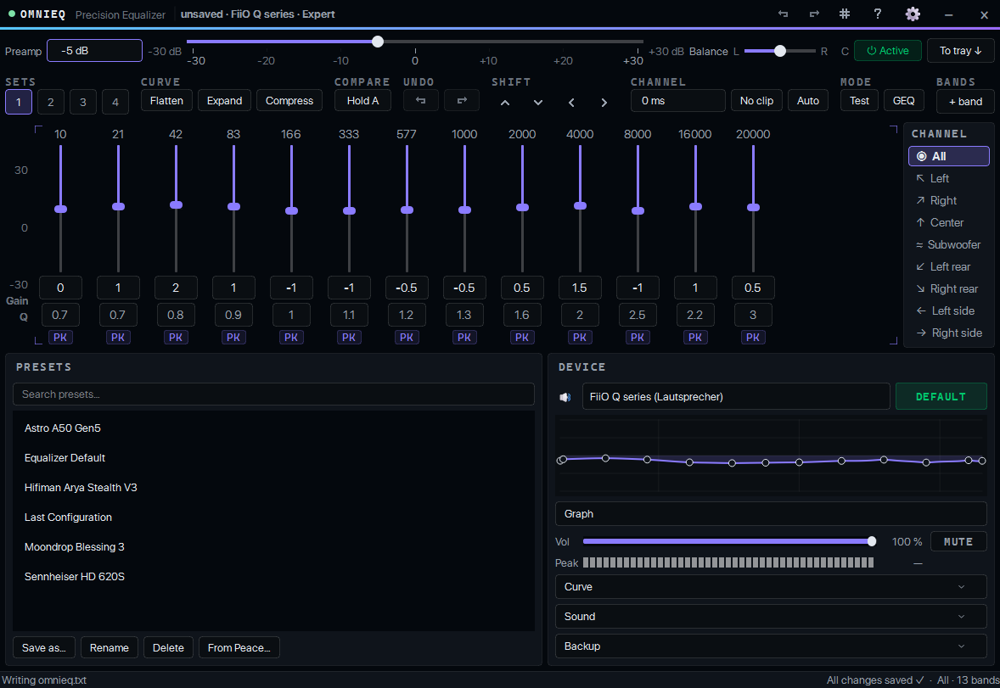
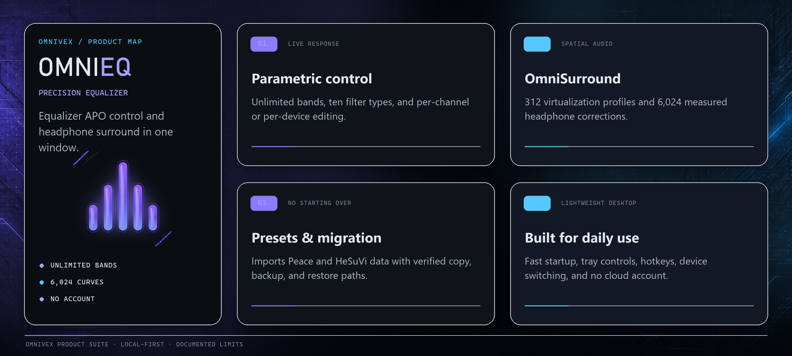
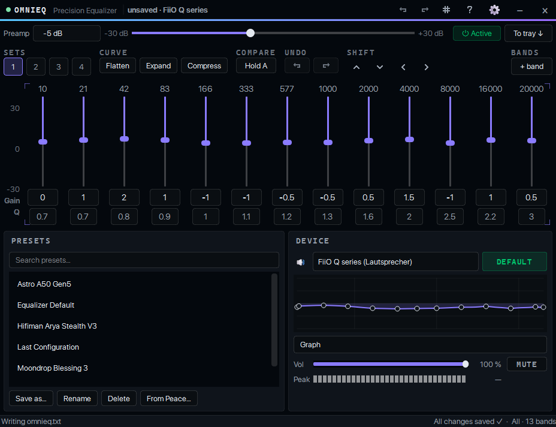
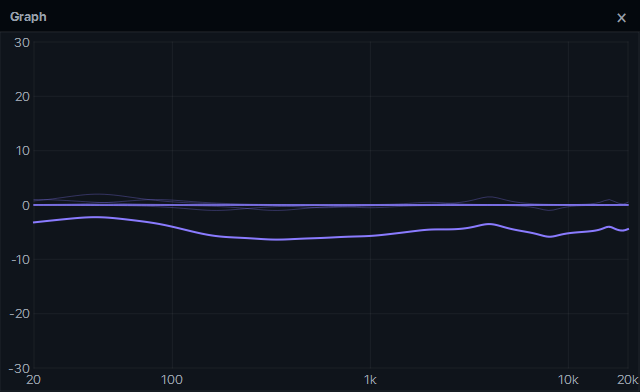
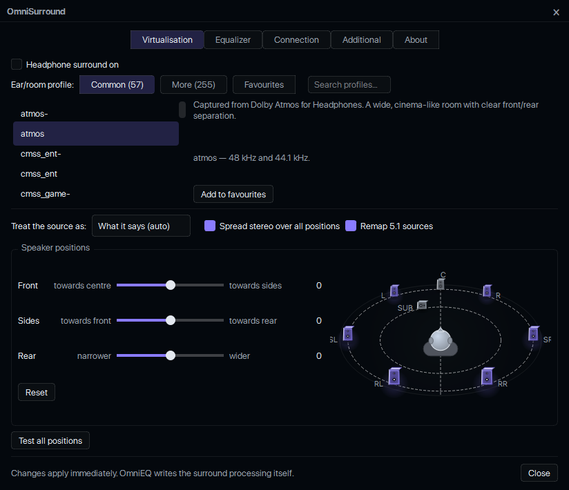
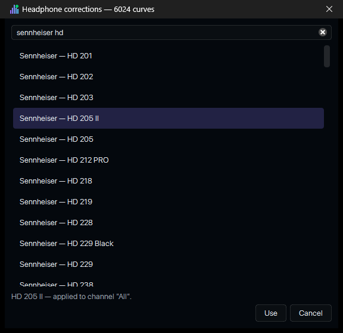
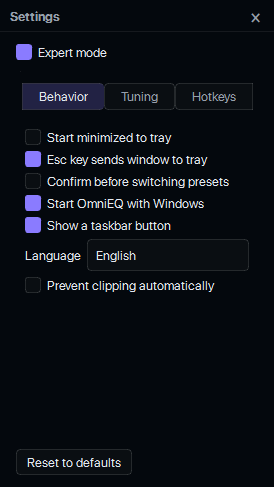
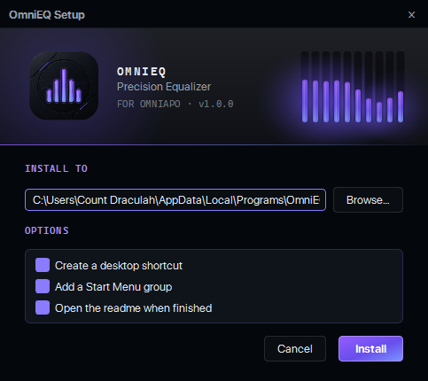
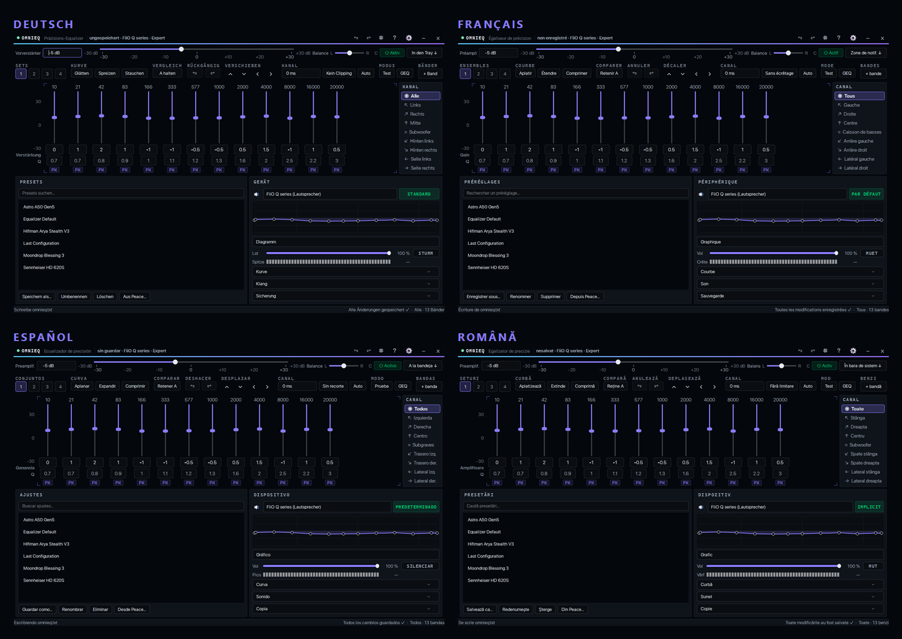

  

<h1 align="center">OmniEQ</h1>

<b>Precision equalizer and headphone surround for Equalizer APO — the modern replacement for Peace and HeSuVi, in one window.</b>

Part of the <a href="#the-omnivex-suite">OmniVex</a> suite.

  
  &nbsp;
  

<!-- Suite metadata: Version · Platform · Languages · Telemetry · Distribution -->

  
  
  
  
  

<!-- Quick navigation. These are clickable: each chip jumps to a section of this
     page, or to the document it names. Anchors are GitHub's own slugs for the
     headings below -- if a heading is renamed, its chip has to be renamed too. -->

  
  
  
  
  
  
  
  
  

> [!IMPORTANT]
> **Documentation-only repository.** This public repository contains OmniEQ documentation, approved artwork, and screenshots—not the application source tree, installer, portable build, signing material, or private build infrastructure. Official distribution remains outside GitHub.

  

---

## What it is

OmniEQ is a native Windows desktop equalizer for **[Equalizer APO](https://sourceforge.net/projects/equalizerapo/)**, the free system-wide audio processing engine. It replaces Peace's parametric editor *and* HeSuVi's headphone surround in a single, fast, dark-themed application — and it can migrate everything you already have in both, then remove them for you.

- **No audio code of its own.** OmniEQ edits the configuration files Equalizer APO already reads. The engine does the processing; OmniEQ makes it fast, safe and pleasant to control.
- **No cloud, no accounts, no telemetry.** One optional, off-by-default checkbox fetches new AutoEq curves from two named GitHub addresses; with it off OmniEQ opens no socket at all. Everything ships in the installer. [PRIVACY.md](PRIVACY.md)
- **Built for daily use.** 1.2 MB executable, ~450 ms to a visible window, 0.03 % of one core when hidden in the tray.

> **OmniEQ is donationware.** It is not sold in stores and there is no free download. Supporters on Patreon and Ko-fi get the installer and the portable build — see [Get OmniEQ](#get-omnieq).

---

## Feature overview

<table>
<tr>
<td width="50%" valign="top">

### 🎚️ Equalizer
- Parametric EQ with **as many bands as you like** and ten filter types (peaking, low/high shelf incl. Q variants, low/high pass, notch, band-pass, all-pass)
- **Graphic EQ mode** per channel, switchable at any time — parametric filters are parked, not lost
- **Per-channel** editing: All · L · R · C · Sub · rear · side
- **Per-device** configurations, with automatic preset switching when your output device changes
- Preamp, balance, per-channel **delay**, and an automatic **clipping guard**
- Curve tools: flatten, expand, compress, nudge, shift
- **Undo / redo** and **A/B compare** against a held reference
- **Sets 1–4**: four quick slots for instant comparison
- Loudness compensation (equal-loudness contour) and headphone **crossfeed**
- Frequency-response **graph** — embedded and draggable, or as its own window
- Tone-test generator and a live **peak meter** in dBFS

</td>
<td width="50%" valign="top">

### 🎧 OmniSurround
- Headphone surround virtualisation with **312 ear/room profiles** (57 captured virtualisations + 255 research HRTF sets) and **6 024 headphone-correction curves** bundled in from the start — or taken over from your existing HeSuVi installation instead, then HeSuVi can go
- Everything HeSuVi's own window could set, in five tabs: two profile lists with descriptions, source format, stereo/5.1 upmix, **speaker positions with a draggable 3D-style layout**, a per-position 7.1 test, eight channel levels, master, LFE-to-centre, four speaker-group EQs with the correction library one click away, output routing, crossfeed (six parameters)
- Changes apply **immediately** — no restart, no re-registration

### 🗂️ Presets & migration
- Presets with search, rename, hotkeys per preset, and a tray picker
- **Import from Peace** — every `.peace` profile, then Peace's own uninstaller, then a config.txt repair
- AutoEQ file import; AutoEQ database browser (Peace's database, or **8 850 equalisations imported from AutoEq's own results folder** — no Peace needed)
- Headphone-correction browser — a measured curve is applied **as itself**, nothing resampled — and a one-menu update straight from AutoEq that takes the library from **1 355 to 6 024 curves**
- **Back up everything to one file**, restore it anywhere

### ⚙️ Desktop
- Tray icon with live state (active / off / engine broken), EQ on/off, global hotkeys
- Volume and mute for the selected endpoint; set it as Windows default
- Lite and Expert modes; UI text scale; follows Windows light/dark; per-monitor DPI
- **Five languages**: English, Deutsch, Español, Français, Română
- VST2 effects and free Equalizer APO commands per channel

</td>
</tr>
</table>

Full list with details: **[FEATURES.md](FEATURES.md)**

---

## Coming from Peace or HeSuVi?

You do not start over. In three clicks each:

1. **Presets › From Peace…** imports every profile, then offers to run Peace's own uninstaller and puts back any `config.txt` line it took with it.
2. **Sound › OmniSurround… › Additional › Move into OmniEQ…** copies HeSuVi's profile and correction library into OmniEQ's own folder, brings your settings along, switches the processing over — and only then, on a second, separate confirmation, offers to delete HeSuVi's folder.

Nothing is deleted before it has been copied and verified. Details: **[docs/MIGRATING.md](docs/MIGRATING.md)**

---

## Screenshots

<table>
<tr>
<td align="center" width="50%"> <b>Lite mode</b> — the essentials, nothing else</td>
<td align="center" width="50%"> <b>Frequency response</b> — your curve and the effective result</td>
</tr>
<tr>
<td align="center"> <b>OmniSurround</b> — profiles, positions, upmix and a draggable speaker layout</td>
<td align="center"> <b>Headphone corrections</b> — 6 024 measured curves, searchable</td>
</tr>
<tr>
<td align="center"> <b>Settings</b> — behaviour, tuning, hotkeys</td>
<td align="center"> <b>Installer</b> — or use the portable zip</td>
</tr>
</table>

   
  Deutsch · Français · Español · Română — every string translated and checked on screen, not just in the catalogue

---

## Requirements

| | |
|---|---|
| **Windows** | Windows 11, 64-bit (tested). Windows 10 64-bit should work but is not tested. |
| **Equalizer APO** | 1.2.1 or newer, installed and registered on the output device you want to equalise. Free and open source: [equalizerapo.com](https://equalizerapo.com/) |
| **Runtime** | None to install: the Microsoft Visual C++ runtime ships next to the program |
| **Disk** | about 45 MB |
| **Optional** | An existing **HeSuVi** installation, if you want OmniSurround's profile library · An existing **Peace** installation, if you want its presets · Neither is needed for the AutoEQ database or the correction curves: both can be imported from the AutoEq project itself |

OmniEQ does not install, configure or repair Equalizer APO itself; it edits the files Equalizer APO reads.

---

## Get OmniEQ

OmniEQ is **donationware**. Supporters receive both builds — the installer (`OmniEQSetup.exe`) and the portable zip — plus updates:

  
  &nbsp;&nbsp;
  

Neither the installer nor the source code is published on GitHub. This repository is the project's public face: documentation, screenshots, the licence, and the issue tracker.

---

## Documentation

| | |
|---|---|
| [Installation](INSTALLATION.md) | Install, first run, activating OmniEQ, daily use |
| [Features](FEATURES.md) | The complete list, with what each thing actually does |
| [Migrating from Peace and HeSuVi](docs/MIGRATING.md) | Step by step, with what happens on disk |
| [FAQ & troubleshooting](FAQ.md) | "No sound", "not registered", "where are my presets" |
| [Privacy](PRIVACY.md) | Local data, optional network access, and telemetry boundaries |
| [Support](SUPPORT.md) | Useful reports, privacy redaction, and contact routes |
| [Security](SECURITY.md) | Private vulnerability reporting |
| [Contributing](CONTRIBUTING.md) | Documentation and reproducible-report scope |
| [Changelog](CHANGELOG.md) | What changed in each version |

---

### Legal and licensing

- **Licence:** OmniEQ is proprietary donationware. Personal use on your own machines; no redistribution. Full terms: [LICENSE.md](LICENSE.md)
- **Privacy:** no data leaves your computer. [PRIVACY.md](PRIVACY.md)

---

## The OmniVex suite

OmniEQ is one of a family of tools sharing a design language and a philosophy —
modern, fast, no telemetry:

**OmniTheme** · **OmniBlock** · **OmniCleaner** · **OmniAPO** · **OmniEQ** · **OmniPlay** · **OmniScale** · **OmniShade** · **OmniVisuals** · **OmniGPU** · **OmniWrappers**

**OmniWrappers** is four Direct3D compatibility installers — OmniDXVK, OmniDxWrapper, OmniVKD3D and OmniVoodoo2.

Tuned for framerate, mixed for headroom, sharp to the pixel. Donationware
tools for gamers and audiophiles — audio, graphics, and a bit of privacy too.

More at [github.com/TheOmniGrid](https://github.com/TheOmniGrid).

---

## Credit

**OmniEQ was written from scratch.** Peace and HeSuVi were the reference for what it should
do; they are not where its code came from. No code from either was copied, ported or
translated, and the filter-response maths comes from the public Audio EQ Cookbook rather
than from Peace's source.

**OmniSurround's** processing chain does reproduce the signal flow **HeSuVi** established
for Equalizer APO, and its default mixing coefficients were taken from the configuration
HeSuVi generates. The arrangement is HeSuVi's; the implementation is OmniEQ's, and the debt
is gladly acknowledged.

It ships **[AutoEq](https://github.com/jaakkopasanen/AutoEq)** measurement data by
**Jaakko Pasanen** (MIT), and links Qt 6.10 (LGPL v3) and miniz (MIT). It runs on top of
**Equalizer APO** by **Jonas Thedering** (GPL v2), which it does not include.

Full attribution in [THIRD-PARTY-NOTICES.md](THIRD-PARTY-NOTICES.md).

*Equalizer APO, Peace and HeSuVi are independent projects by their respective authors.
OmniEQ is not affiliated with or endorsed by them.*

---

## Contact

Use public channels only for information that is safe to share. Remove usernames, local paths,
account identifiers, licence data, and other personal information from screenshots and logs.

| Channel | Use |
|---|---|
| [GitHub Issues](../../issues/new/choose) | Reproducible bugs, compatibility reports, and documentation corrections |
| [GitHub Discussions](../../discussions) | Questions, ideas, and community support |
| [Security](SECURITY.md) | Private vulnerability reporting — never use a public issue |
| [Email](mailto:omnivex@theomnigrid.biz) | Private support, delivery, or licensing questions |

Support is best-effort. See [SUPPORT.md](SUPPORT.md) and [CONTRIBUTING.md](CONTRIBUTING.md)
for repository scope and reporting guidance.

---

  <strong>OmniEQ</strong> 
  <a href="https://github.com/TheOmniGrid">The OmniGrid on GitHub</a> ·
  <a href="https://ko-fi.com/theomnigrid">Ko-fi</a> ·
  <a href="https://www.patreon.com/TheOmniGrid">Patreon</a>  
  Copyright © 2026 OmniVex · Proprietary donationware · <a href="LICENSE.md">Legal &amp; licensing</a> 
  Equalizer APO, Peace, HeSuVi and AutoEq are the work of their respective authors; OmniEQ is not affiliated with them.

