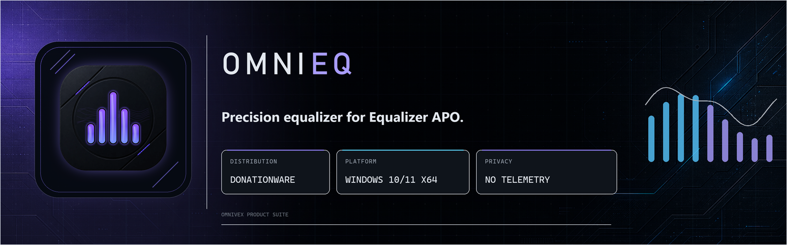

  

<h1 align="center">OmniEQ</h1>

<b>Precision equalizer and headphone surround for Equalizer APO — the modern replacement for Peace and HeSuVi, in one window.</b>

  
  &nbsp;
  

  
  
  
  
  

  

---

## What it is

OmniEQ is a native Windows desktop equalizer for **[Equalizer APO](https://sourceforge.net/projects/equalizerapo/)**, the free system-wide audio processing engine. It replaces Peace's parametric editor *and* HeSuVi's headphone surround in a single, fast, dark-themed application — and it can migrate everything you already have in both, then remove them for you.

- **No audio code of its own.** OmniEQ edits the configuration files Equalizer APO already reads. The engine does the processing; OmniEQ makes it fast, safe and pleasant to control.
- **No cloud, no accounts, no telemetry.** It contains no network code at all — verified in the source, stated in [PRIVACY.md](PRIVACY.md).
- **Built for daily use.** 1.2 MB executable, ~450 ms to a visible window, 0.03 % of one core when hidden in the tray.

> **OmniEQ is donationware.** It is not sold in stores and there is no free download. Supporters on Patreon and Ko-fi get the installer and the portable build — see [Getting it](#getting-it).

---

## Feature overview

<table>
<tr>
<td width="50%" valign="top">

### 🎚️ Equalizer
- Parametric EQ with **as many bands as you like** and ten filter types (peaking, low/high shelf incl. Q variants, low/high pass, notch, band-pass, all-pass)
- **Graphic EQ mode** per channel, switchable at any time — parametric filters are parked, not lost
- **Per-channel** editing: All · L · R · C · Sub · rear · side
- **Per-device** configurations, with automatic preset switching when your output device changes
- Preamp, balance, per-channel **delay**, and an automatic **clipping guard**
- Curve tools: flatten, expand, compress, nudge, shift
- **Undo / redo** and **A/B compare** against a held reference
- **Sets 1–4**: four quick slots for instant comparison
- Loudness compensation (equal-loudness contour) and headphone **crossfeed**
- Frequency-response **graph** — embedded and draggable, or as its own window
- Tone-test generator and a live **peak meter** in dBFS

</td>
<td width="50%" valign="top">

### 🎧 OmniSurround
- Headphone surround virtualisation with **312 ear/room profiles** (57 captured virtualisations + 255 research HRTF sets) and **1 355 headphone-correction curves** — taken over from your existing HeSuVi installation, then HeSuVi can go
- Everything HeSuVi's own window could set, in five tabs: two profile lists with descriptions, source format, stereo/5.1 upmix, **speaker positions with a draggable 3D-style layout**, a per-position 7.1 test, eight channel levels, master, LFE-to-centre, four speaker-group EQs with the correction library one click away, output routing, crossfeed (six parameters)
- Changes apply **immediately** — no restart, no re-registration

### 🗂️ Presets & migration
- Presets with search, rename, hotkeys per preset, and a tray picker
- **Import from Peace** — every `.peace` profile, then Peace's own uninstaller, then a config.txt repair
- AutoEQ file import; AutoEQ database browser (uses the database Peace ships)
- Headphone-correction browser — a measured curve is applied **as itself**, nothing resampled
- **Back up everything to one file**, restore it anywhere

### ⚙️ Desktop
- Tray icon with live state (active / off / engine broken), EQ on/off, global hotkeys
- Volume and mute for the selected endpoint; set it as Windows default
- Lite and Expert modes; UI text scale; follows Windows light/dark; per-monitor DPI
- **Five languages**: English, Deutsch, Español, Français, Română
- VST2 effects and free Equalizer APO commands per channel

</td>
</tr>
</table>

Full list with details: **[docs/FEATURES.md](docs/FEATURES.md)**

---

## Screenshots

<table>
<tr>
<td align="center" width="50%"> <b>Lite mode</b> — the essentials, nothing else</td>
<td align="center" width="50%"> <b>Frequency response</b> — your curve and the effective result</td>
</tr>
<tr>
<td align="center"> <b>OmniSurround</b> — profiles, positions, upmix and a draggable speaker layout</td>
<td align="center"> <b>Headphone corrections</b> — 1 355 measured curves, searchable</td>
</tr>
<tr>
<td align="center"> <b>Settings</b> — behaviour, tuning, hotkeys</td>
<td align="center"> <b>Installer</b> — or use the portable zip</td>
</tr>
</table>

   
  Deutsch · Français · Español · Română — every string translated and checked on screen, not just in the catalogue

---

## Getting it

OmniEQ is **donationware**. Supporters receive both builds — the installer (`OmniEQSetup.exe`) and the portable zip — plus updates:

  
  &nbsp;
  

Neither the installer nor the source code is published on GitHub. This repository is the project's public face: documentation, screenshots, the licence, and the issue tracker.

### Requirements

| | |
|---|---|
| **Windows** | Windows 11, 64-bit (tested). Windows 10 64-bit should work but is not tested. |
| **Equalizer APO** | 1.2.1 or newer, installed and registered on the output device you want to equalise. Free and open source: [equalizerapo.com](https://equalizerapo.com/) |
| **Runtime** | None to install: the Microsoft Visual C++ runtime ships next to the program |
| **Disk** | about 45 MB |
| **Optional** | An existing **HeSuVi** installation, if you want OmniSurround's profile library · An existing **Peace** installation, if you want its presets and the AutoEQ database |

OmniEQ does not install, configure or repair Equalizer APO itself; it edits the files Equalizer APO reads.

---

## Coming from Peace or HeSuVi?

You do not start over. In three clicks each:

1. **Presets › From Peace…** imports every profile, then offers to run Peace's own uninstaller and puts back any `config.txt` line it took with it.
2. **Sound › OmniSurround… › Additional › Move into OmniEQ…** copies HeSuVi's profile and correction library into OmniEQ's own folder, brings your settings along, switches the processing over — and only then, on a second, separate confirmation, offers to delete HeSuVi's folder.

Nothing is deleted before it has been copied and verified. Details: **[docs/MIGRATING.md](docs/MIGRATING.md)**

---

## Documentation

| | |
|---|---|
| [Getting started](docs/GETTING-STARTED.md) | Install, first run, activating OmniEQ, daily use |
| [Features](docs/FEATURES.md) | The complete list, with what each thing actually does |
| [Migrating from Peace and HeSuVi](docs/MIGRATING.md) | Step by step, with what happens on disk |
| [FAQ & troubleshooting](docs/FAQ.md) | "No sound", "not registered", "where are my presets" |
| [Changelog](CHANGELOG.md) | What changed in each version |

---

## Support & feedback

- **Bugs and feature requests:** [open an issue](https://github.com/%%GITHUB_USER%%/OmniEQ/issues) — templates are provided.
- **Questions:** [Discussions](https://github.com/%%GITHUB_USER%%/OmniEQ/discussions).
- **Security:** see [SECURITY.md](SECURITY.md).

Support is best-effort. OmniEQ is made by one person; supporters' reports get looked at first.

---

## Legal

- **Licence:** OmniEQ is proprietary donationware. Personal use on your own machines; no redistribution. Full terms: [LICENSE.md](LICENSE.md)
- **Privacy:** no data leaves your computer. [PRIVACY.md](PRIVACY.md)
- **Third-party components and credits:** Qt (LGPL v3), miniz (MIT), and the projects OmniEQ works alongside — Equalizer APO, Peace, HeSuVi, AutoEQ. [THIRD-PARTY-NOTICES.md](THIRD-PARTY-NOTICES.md)

*Equalizer APO, Peace and HeSuVi are independent projects by their respective authors. OmniEQ is not affiliated with or endorsed by them.*

Part of the <b>OmniVex</b> family of tools · © %%YEAR%% %%AUTHOR_NAME%%

